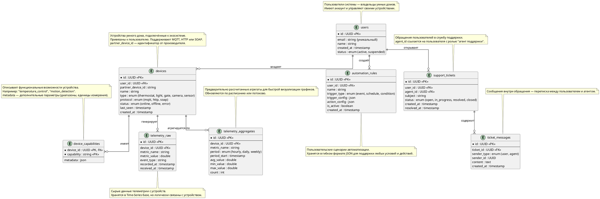

```plantuml
@startuml
' Включаем ER-стиль
hide empty members
skinparam linetype ortho
skinparam entity {
  backgroundColor #F9F9F9
  borderColor #333333
}

' ===== СУЩНОСТИ =====

entity "users" as users {
  * id : UUID <<PK>>
  --
  email : string {уникальный}
  name : string
  created_at : timestamp
  status : enum (active, suspended)
}

note top of users
  Пользователи системы — владельцы умных домов.
  Имеют аккаунт и управляют своими устройствами.
end note

entity "devices" as devices {
  * id : UUID <<PK>>
  --
  user_id : UUID <<FK>>
  partner_device_id : string
  name : string
  type : enum (thermostat, light, gate, camera, sensor)
  protocol : enum (mqtt, http, soap)
  status : enum (online, offline, error)
  last_seen : timestamp
  created_at : timestamp
}

note top of devices
  Устройства умного дома, подключённые к экосистеме.
  Привязаны к пользователю. Поддерживают MQTT, HTTP или SOAP.
  partner_device_id — идентификатор от производителя.
end note

entity "device_capabilities" as device_capabilities {
  * device_id : UUID <<PK, FK>>
  * capability : string <<PK>>
  --
  metadata : json
}

note top of device_capabilities
  Описывает функциональные возможности устройства.
  Например: "temperature_control", "motion_detection".
  metadata — дополнительные параметры (диапазоны, единицы измерения).
end note

entity "automation_rules" as automation_rules {
  * id : UUID <<PK>>
  --
  user_id : UUID <<FK>>
  name : string
  trigger_type : enum (event, schedule, condition)
  trigger_config : json
  action_config : json
  is_active : boolean
  created_at : timestamp
}

note bottom of automation_rules
  Пользовательские сценарии автоматизации.
  Хранятся в гибком формате JSON для поддержки любых условий и действий.
end note

entity "support_tickets" as support_tickets {
  * id : UUID <<PK>>
  --
  user_id : UUID <<FK>>
  agent_id : UUID <<FK>>
  subject : string
  status : enum (open, in_progress, resolved, closed)
  created_at : timestamp
  resolved_at : timestamp
}

note top of support_tickets
  Обращения пользователей в службу поддержки.
  agent_id ссылается на пользователя с ролью "агент поддержки".
end note

entity "ticket_messages" as ticket_messages {
  * id : UUID <<PK>>
  --
  ticket_id : UUID <<FK>>
  sender_type : enum (user, agent)
  sender_id : UUID
  content : text
  created_at : timestamp
}

note top of ticket_messages
  Сообщения внутри обращения — переписка между пользователем и агентом.
end note

entity "telemetry_raw" as telemetry_raw {
  * id : UUID <<PK>>
  --
  device_id : UUID <<FK>>
  metric_name : string
  metric_value : double
  event_type : string
  recorded_at : timestamp
  received_at : timestamp
}

note bottom of telemetry_raw
  Сырые данные телеметрии с устройств.
  Хранятся в Time-Series базе, но логически связаны с устройством.
end note

entity "telemetry_aggregates" as telemetry_aggregates {
  * id : UUID <<PK>>
  --
  device_id : UUID <<FK>>
  metric_name : string
  period : enum (hourly, daily, weekly)
  period_start : timestamp
  avg_value : double
  min_value : double
  max_value : double
  count : int
}

note top of telemetry_aggregates
  Предварительно рассчитанные агрегаты для быстрой визуализации графиков.
  Обновляются по расписанию или потоково.
end note

' ===== СВЯЗИ =====

users ||--o{ devices : "владеет"
users ||--o{ automation_rules : "создаёт"
users ||--o{ support_tickets : "открывает"

devices ||--o{ device_capabilities : "имеет"
devices ||--o{ telemetry_raw : "генерирует"
devices ||--o{ telemetry_aggregates : "агрегируется по"

support_tickets ||--o{ ticket_messages : "содержит"

@enduml
```